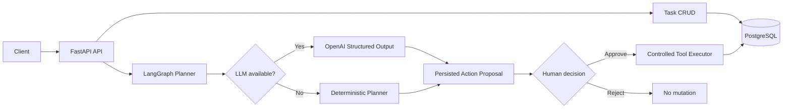

# AgentDesk AI

Production-oriented **AI task orchestration backend** built with FastAPI, PostgreSQL, LangGraph, SQLAlchemy, Alembic and Docker.

AgentDesk combines a normal task-management REST API with an AI planning layer. The agent can inspect open tasks and propose controlled actions, but mutations are persisted as proposals first and require an explicit human approval request before execution.

## Features

- Async FastAPI backend
- Complete task CRUD API
- PostgreSQL persistence with SQLAlchemy 2.x
- Alembic database migrations
- LangGraph orchestration workflow
- Structured OpenAI planning when `OPENAI_API_KEY` is configured
- Deterministic offline fallback for demo/testing
- Persistent agent-run history
- Human-in-the-loop approval and rejection endpoints
- Controlled action execution for task creation and status changes
- Request logging
- Docker + Docker Compose
- Pytest integration tests
- GitHub Actions CI

## Architecture



## Quick start

```bash
cp .env.example .env
docker compose up --build
```

The Compose stack waits for PostgreSQL, applies Alembic migrations, and starts the API.

- Swagger UI: `http://localhost:8000/docs`
- Health: `http://localhost:8000/health`

## Example flow

Create a task:

```bash
curl -X POST http://localhost:8000/api/v1/tasks \
  -H "Content-Type: application/json" \
  -d '{"title":"Prepare portfolio release"}'
```

Ask the agent to propose an action:

```bash
curl -X POST http://localhost:8000/api/v1/agent/triage \
  -H "Content-Type: application/json" \
  -d '{"request":"Mark task #1 done"}'
```

The response is saved as an agent run with status `proposed`. No task is mutated yet.

Approve the run:

```bash
curl -X POST http://localhost:8000/api/v1/agent/runs/1/approve
```

Or reject it:

```bash
curl -X POST http://localhost:8000/api/v1/agent/runs/1/reject
```

## Main endpoints

- `POST /api/v1/tasks`
- `GET /api/v1/tasks`
- `GET /api/v1/tasks/{task_id}`
- `PATCH /api/v1/tasks/{task_id}`
- `DELETE /api/v1/tasks/{task_id}`
- `POST /api/v1/agent/triage`
- `GET /api/v1/agent/runs`
- `GET /api/v1/agent/runs/{run_id}`
- `POST /api/v1/agent/runs/{run_id}/approve`
- `POST /api/v1/agent/runs/{run_id}/reject`

## LLM and offline modes

If `OPENAI_API_KEY` is set, the planner uses the configured OpenAI model and validates its response against a structured action schema.

Without a key, the application remains runnable and testable using a deterministic planner for explicit requests such as:

- `Mark task #3 done`
- `Start task #2`
- `Create a task: Review release notes`

## Tech stack

`Python 3.12` · `FastAPI` · `Pydantic` · `SQLAlchemy 2` · `PostgreSQL` · `Alembic` · `Docker` · `LangGraph` · `OpenAI` · `pytest` · `GitHub Actions`

## Safety boundary

The agent is deliberately separated into **planning** and **execution**. LLM output is never applied to the database automatically. Proposed actions are validated, persisted, and only executed through an explicit approval endpoint.
