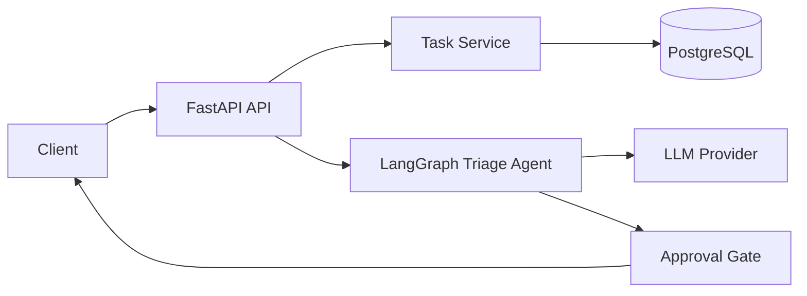

# AgentDesk AI

Production-oriented AI task orchestration backend built with **FastAPI, PostgreSQL, Docker, LangGraph, SQLAlchemy and Alembic**.

The project is being built as a portfolio-grade example of modern Python backend and agentic AI engineering: REST APIs, persistent storage, asynchronous I/O, LLM integration, stateful agent workflows, approval gates, tests and containerized local development.

## Current capabilities

- Async FastAPI backend
- REST API for task CRUD
- PostgreSQL persistence with SQLAlchemy 2.x
- Alembic database migrations
- Docker + Docker Compose local environment
- LangGraph-based task triage workflow
- Optional OpenAI integration with a deterministic local fallback
- Human-in-the-loop style approval gate: agent proposes actions but does not mutate tasks automatically
- Pytest test suite
- GitHub Actions CI

## Architecture



## Quick start

```bash
cp .env.example .env
docker compose up --build
```

API docs: `http://localhost:8000/docs`

Run migration inside the API container:

```bash
docker compose exec api alembic upgrade head
```

## Example flow

1. Create several tasks through `/api/v1/tasks`.
2. Call `/api/v1/agent/triage` with a natural-language request.
3. The LangGraph workflow analyzes open tasks and returns a summary plus proposed actions.
4. Actions are returned as proposals with `requires_approval=true`; the agent does not silently change stored data.

## Tech stack

`Python` · `FastAPI` · `Pydantic` · `SQLAlchemy` · `PostgreSQL` · `Alembic` · `Docker` · `LangGraph` · `OpenAI API` · `pytest` · `GitHub Actions`

## Roadmap for this sprint

- Tool/function calling for controlled task actions
- Persistent agent runs and approval records
- Redis-backed background jobs
- Authentication and permissions
- Observability and structured logging
- Deployment behind Nginx on Linux

## Why this project exists

AgentDesk AI is intentionally more than a chatbot wrapper. The goal is to demonstrate backend engineering and agent orchestration together: data modeling, APIs, persistence, migrations, containerization, tests, workflow state, LLM integration and explicit approval boundaries.
